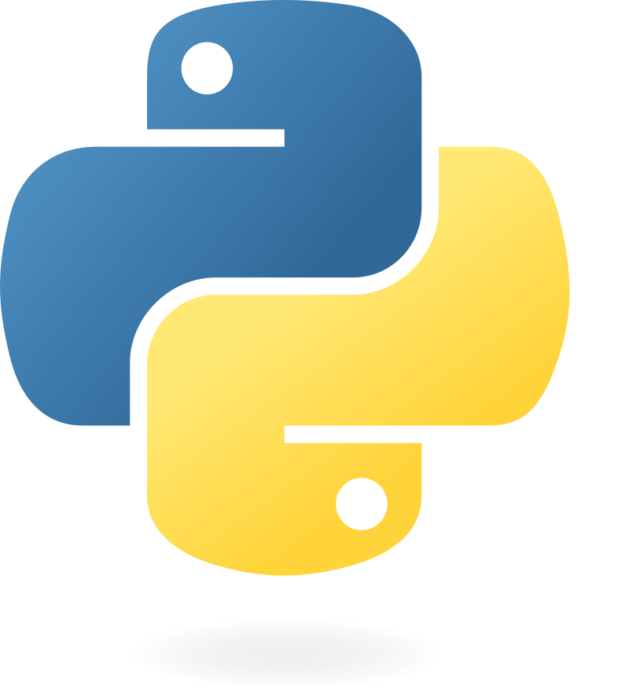

# Jornada de Dados

Nessa parte vamos entender e trabalhar mais com Python, uma das linguagens mais importantes quando trabalhamos com dados.

## Aula 0

Print, input, criacao de variaveis, tipos primitivos e typecast simples, além de fstring

## Aula 1

TypeError, Type Check, Type Conversion, try-except e if

## Aula 2

Controle de Fluxo: DEBUG, IF, FOR, While, Listas e Dicionários

## Aula 3

Tipos complexos e Type Hint (Dicionários vs DataFrames Vs Tabelas Vs Excel)

## Aula 4

Projeto de leitura de linhas, entendimento do projeto e interpretação das funções.

## Aula 6

Mais sobre funções, parâmetros e boas práticas com funções. Além da criação de módulos e uso desses modulos.
